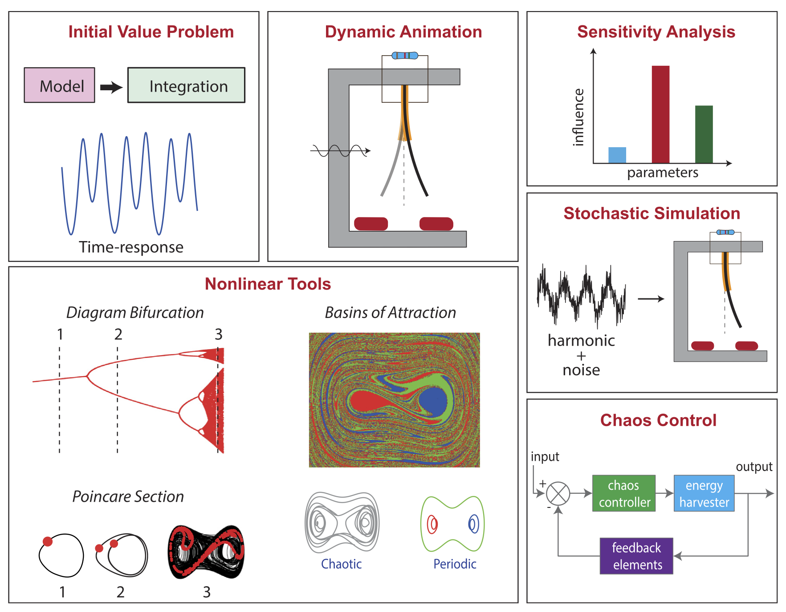
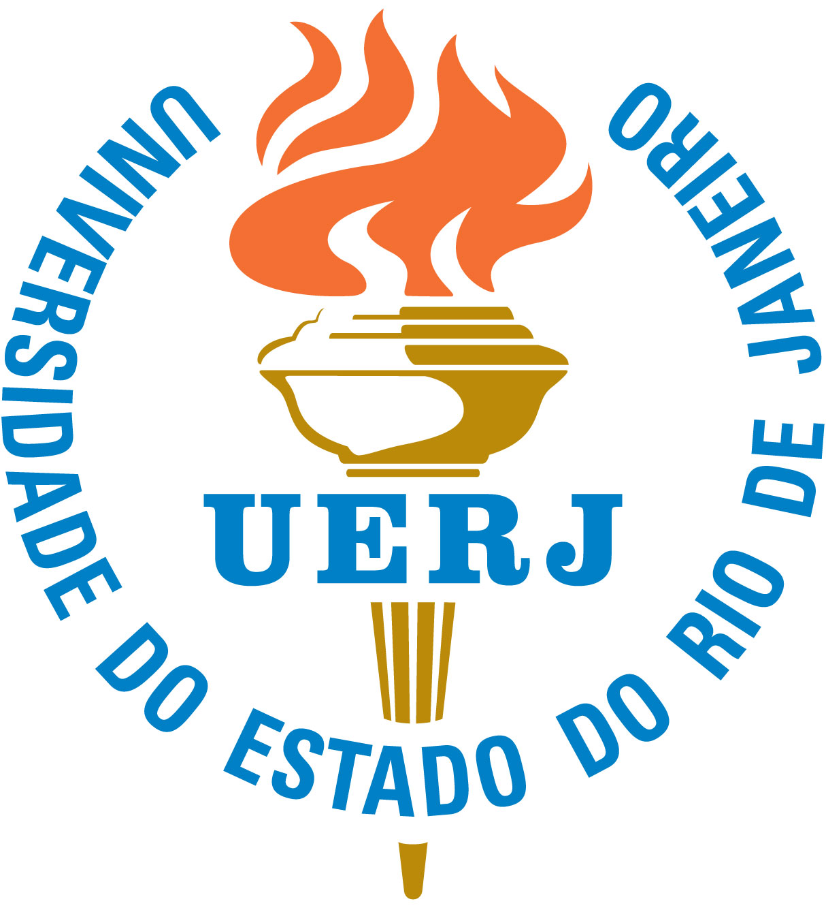

## Dynamic Mode Decomposition Engine

**DynaMoDE - Dynamic Mode Decomposition Engine** is an ensemble of ...

<p align="center">

</p>

### Table of Contents
- [Overview](#overview)
- [Features](#features)
- [Usage](#usage)
- [Documentation](#documentation)
- [Reproducibility](#reproducibility)
- [Authors](#authors)
- [Citing STONEHENGE](#citing-stonehenge)
- [License](#license)
- [Institutional support](#institutional-support)
- [Funding](#funding)
- [Contact](#contact)

### Overview
**DynaMoDE** was developed to ...
- **J. P. Norenberg, J. V. L. L. Peterson, V. G. Lopes, R. Luo, L. de la Roca, M. Pereira, J. G. Telles Ribeiro, A. Cunha Jr**, *STONEHENGE - Suite for Nonlinear Analysis of Energy Harvesting Systems*, Software Impacts, vol. 10, pp. 100161, 2021. <a href="http://dx.doi.org/10.1016/j.simpa.2021.100161" target="_blank">DOI</a>

### Features
- Comprehensive nonlinear dynamic analysis of energy harvesting systems
- Simulation, optimization, control, and visualization tools
- Robust framework for numerical experimentation
- Fully reproducible simulations

### Usage
To get started with **DynaMoDE**, follow these steps:
1. Clone the repository:
   ```bash
   git clone https://github.com/americocunhajr/STONEHENGE.git
   ```
2. Navigate to the package directory:
   ```bash
   cd STONEHENGE/STONEHENGE-1.0
   ```

**DynaMoDE** can be used to simulate, optimize, control, and visualize the dynamics of bistable piezoelectric-magneto-elastic energy harvesters. Detailed usage instructions and examples are provided within the code comments and the provided documentation.

### Documentation
The routines in **DynaMoDE** are well-commented to explain their functionality. Each routine includes a description of its purpose, as well as inputs and outputs. Detailed documentation can be found within the code comments. An user-manual is available showing the package functionalities.

### Reproducibility
Simulations done with **DynaMoDE** are fully reproducible. You can find a fully reproducible capsule of the simulations on <a href="https://codeocean.com/capsule/4891890/tree/v1" target="_blank">CodeOcean</a>.

### Authors
- Lucas Simon Araújo
- Samuel da Silva
- Americo Cunha Jr

### Citing DynaMoDE
If you use **DynaMoDE** in your research, please cite the following publication:
- *J. P. Norenberg, J. V. L. L. Peterson, V. G. Lopes, R. Luo, L. de la Roca, M. Pereira, J. G. Telles Ribeiro, A. Cunha Jr, STONEHENGE - Suite for Nonlinear Analysis of Energy Harvesting Systems, Software Impacts, 10:100161, 2021 http://dx.doi.org/10.1016/j.simpa.2021.100161*

```
@article{DynaMoDE2024,
   author       = "{L. S. Ara\'{u}jo and S. {da Silva} and A. {Cunha~Jr}}",
   title        = {~},
   year         = {2024},
   journal      = {~},
   volume.      = {~},
   pages        = {~},
   note         = {~},
}
```

### License

**DynaMoDE** is released under the MIT license. See the LICENSE file for details. All new contributions must be made under the MIT license.

 

### Institutional support

 &nbsp; &nbsp; 

### Funding

 &nbsp; &nbsp;  &nbsp; &nbsp; 

### Contact
For any questions or further information, please contact the third author at:

- Americo Cunha Jr: americo.cunha@uerj.br
