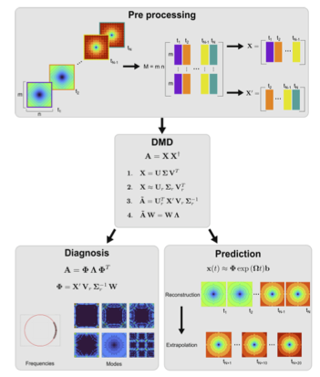
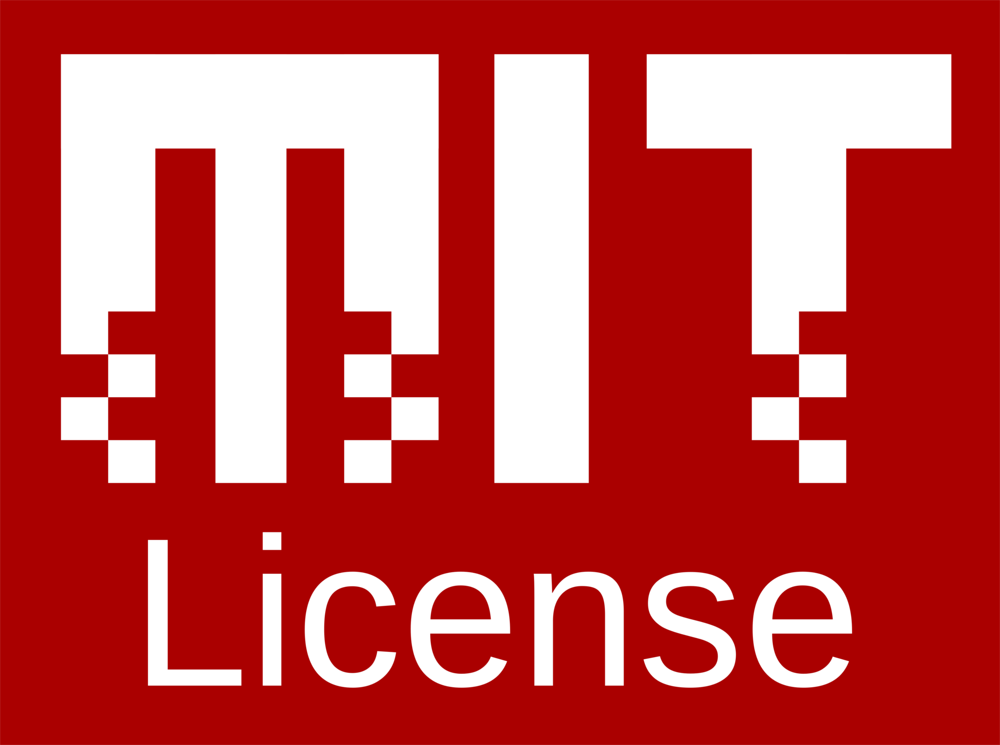
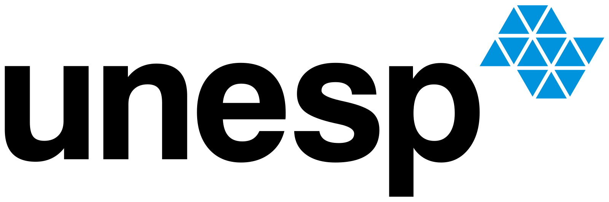
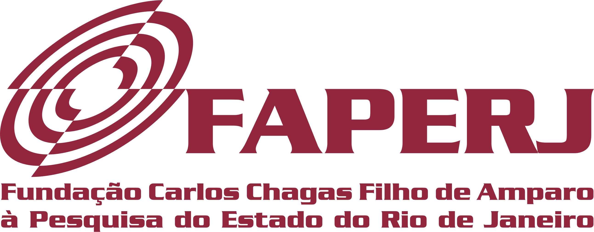
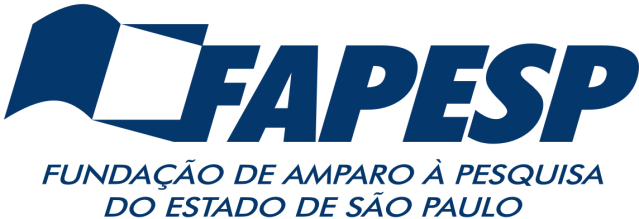
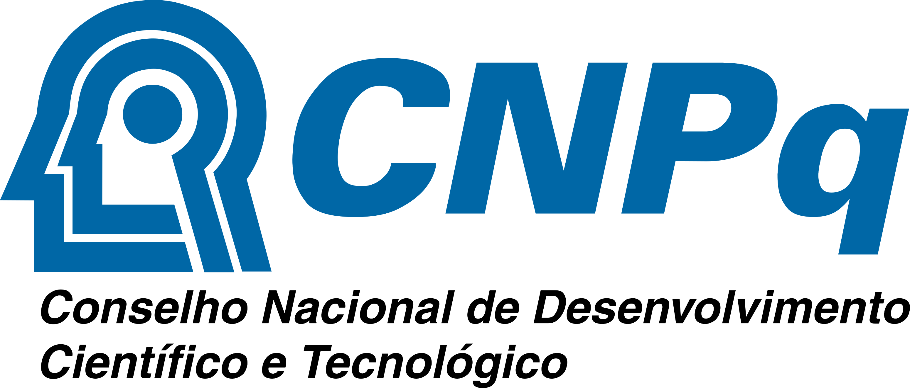
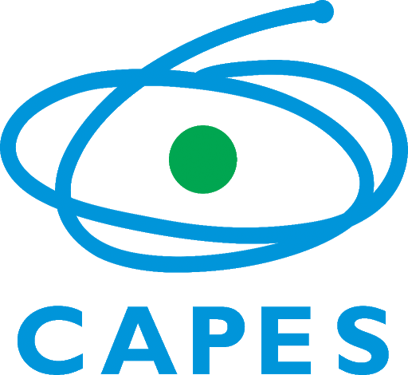

## Dynamic Mode Decomposition Engine

**DynaMoDE - Dynamic Mode Decomposition Engine** is a modular framework for data-driven analysis and reduced-order modeling of dynamical systems based on Dynamic Mode Decomposition (DMD) and Koopman operator theory.


<p align="center">

</p>

### Table of Contents
- [Overview](#overview)
- [Features](#features)
- [Usage](#usage)
- [Documentation](#documentation)
- [Authors](#authors)
- [Citing DynaMoDE](#citing-dynamode)
- [License](#license)
- [Institutional support](#institutional-support)
- [Funding](#funding)
- [Contact](#contact)

### Overview
**DynaMoDE** was developed to support the analysis, reconstruction, and interpretation of complex dynamical systems from data, with emphasis on:
- Dynamic Mode Decomposition (DMD)
- Koopman operator approximation
- Spatiotemporal pattern extraction
- Reduced-order modeling from experimental or simulated data

The framework is designed to bridge theoretical concepts and practical applications, including scenarios with noisy, sparse, or low-resolution measurements, such as those encountered in thermal systems and engineering experiments.

This repository accompanies the development presented in:
- *L. S. Araújo, S. da Silva, A. Cunha Jr.*, Foundations of Dynamic Mode Decomposition for Data-Driven Modeling. In: *Scientific Machine Learning for Predictive Modeling: Bridging Data-Driven and Physics-Based Approaches in Computational Science and Engineering*, edited by A. Cunha Jr, F. P. Santos, F. A. Rochinha, and A. L. G. A. Coutinho, Springer, 2026.
- *M. E. P. Silva et al.*, Characterization of Thermal Systems from Noisy and Low-resolution Measurements Using DMD. In: *Scientific Machine Learning for Predictive Modeling: Bridging Data-Driven and Physics-Based Approaches in Computational Science and Engineering*, edited by A. Cunha Jr, F. P. Santos, F. A. Rochinha, and A. L. G. A. Coutinho, Springer, 2026.

### Features
- Data-driven identification of dynamical systems using DMD
- Koopman-based modal decomposition and spectral analysis
- Reconstruction and prediction of spatiotemporal fields
- Handling of noisy, sparse, and low-resolution datasets
- Singular value analysis and rank truncation strategies
- MATLAB implementations for pedagogical and research use
- Reproducible workflows aligned with published studies

### Usage
To get started with **DynaMoDE**, follow these steps:
1. Clone the repository:
   ```bash
   git clone https://github.com/americocunhajr/DynaMoDE.git
   ```
2. Navigate to the package directory:
   ```bash
   cd DynaMoDE/DynaMoDE-1.0
   ```
3. Run the DMD scripts provided in the corresponding folders

The code includes examples of:
- Synthetic benchmark datasets (e.g., Ackley and Rastrigin functions)
- Experimental thermal data (sensor-based and image-based)
- Reconstruction and truncation analysis

### Documentation
The routines in **DynaMoDE** are well-commented to explain their functionality. Each routine includes a description of its purpose, as well as inputs and outputs. Detailed documentation can be found within the code comments.

### Authors
- Lucas Simon Araújo
- Maria Eduarda P. Silva
- Fernanda Thais Colombo
- Samuel da Silva
- Americo Cunha Jr

### Citing DynaMoDE
If you use **DynaMoDE** in your research, please cite the following publication:
- *L. S. Araújo, S. da Silva, A. Cunha Jr.*, Foundations of Dynamic Mode Decomposition for Data-Driven Modeling. In: *Scientific Machine Learning for Predictive Modeling: Bridging Data-Driven and Physics-Based Approaches in Computational Science and Engineering*, edited by A. Cunha Jr, F. P. Santos, F. A. Rochinha, and A. L. G. A. Coutinho, Springer, 2026.

```
@incollection{DynaMoDE2026,
  author    = {L. S. Ara{\'u}jo and S. da Silva and A. Cunha Jr},
  title     = {Dynamic Mode Decomposition for Data-Driven Modeling},
  booktitle = {Scientific Machine Learning for Predictive Modeling: Bridging Data-Driven and Physics-Based Approaches in Computational Science and Engineering},
  editor    = {Americo Cunha Jr and F. P. Santos and F. A. Rochinha and A. L. G . A. Coutinho},
  publisher = {Springer},
  year      = {2026},
  address   = {Cham},
  url       = {https://dmdcode.org},
}
```

### License

**DynaMoDE** is released under the MIT license. See the LICENSE file for details. All new contributions must be made under the MIT license.

 

### Institutional support

 &nbsp; &nbsp;  &nbsp; &nbsp;  

### Funding

 &nbsp; &nbsp;  &nbsp; &nbsp;  &nbsp; &nbsp; 

### Contact
For any questions or further information, please contact the third author at:

- Americo Cunha Jr: americo@lncc.br
